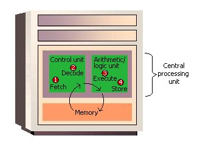
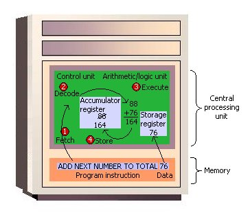

#### Basic knowledge Of computer software

* #### How CPU works
	Computer usually comprised by below components:
	
	* Central Processing Unit (CPU)
	* Memory
	* Input/Output Devices (IO Devices)
	* Storage

	The CPU will execute the instructions stored in the Memory, and the softwares are comprised by various instructions.

	 
	

* #### How source code be executed 
_[http://www.tenouk.com/ModuleW.html](http://www.tenouk.com/ModuleW.html)_
